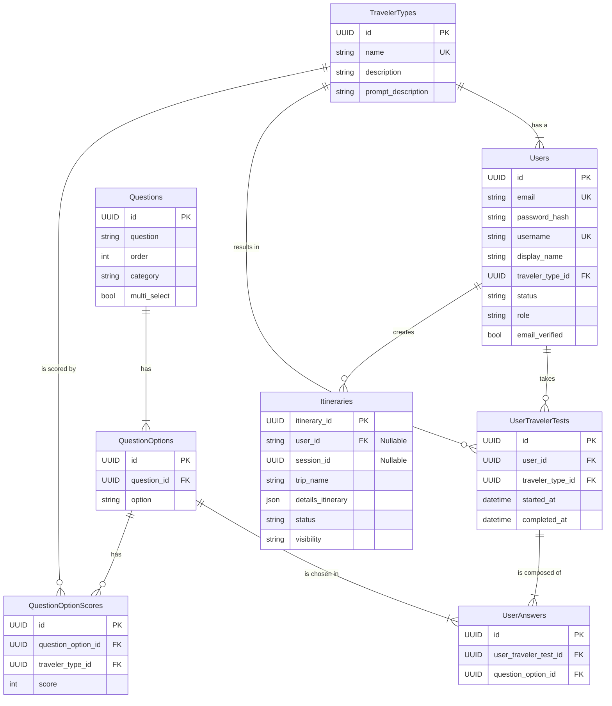

# TravelSmart 🌎✈️

TravelSmart es una plataforma innovadora diseñada para revolucionar la manera en que planificamos nuestros viajes. Combinando la potencia de la inteligencia artificial con la flexibilidad de la planificación manual, TravelSmart ofrece una experiencia única para crear itinerarios de viaje personalizados. Entendemos que cada viajero es único, y por eso, hemos puesto la personalización en el corazón de nuestra herramienta.

Podrás descubrir tu perfil de viajero a través de un innovador "test". Este breve cuestionario nos permite conocer tus gustos, intereses y el tipo de experiencias que buscas. Con esta información, nuestro motor de Inteligencia Artificial no solo genera un itinerario, sino que crea un viaje a tu medida, sugiriendo actividades, lugares y ritmos que se alinean con tu personalidad.

Para quienes aman tener el control, nuestro planificador manual sigue ofreciendo una flexibilidad total. Y gracias a un completo sistema de autenticación, puedes guardar todos tus viajes y acceder a ellos desde cualquier dispositivo.


## 🎯 Sobre el Proyecto

TravelSmart nace de la necesidad de simplificar la planificación de viajes, ofreciendo dos enfoques principales:

### 🤖 Planificación con IA
Nuestro sistema de inteligencia artificial analiza tu destino y la duración de tu viaje para generar automáticamente itinerarios optimizados. La IA considera:
- Puntos de interés más relevantes
- Tiempos de traslado óptimos
- Secuencia lógica de actividades
- Recomendaciones personalizadas basadas en el destino y en las preferencias del usuario

### ✏️ Planificación Manual
Para aquellos que prefieren un control total sobre su itinerario, ofrecemos una interfaz intuitiva que permite:
- Crear planes día a día
- Personalizar actividades
- Organizar tiempos y secuencias
- Flexibilidad total en la planificación

## 🌟 Características Principales

- **Interfaz Intuitiva**: Diseño moderno y fácil de usar que hace la planificación de viajes una experiencia agradable
- **Flexibilidad**: Libertad para elegir entre planificación automática, manual o híbrida
- **Perfiles de Viajero Personalizados**: Realiza nuestro "Traveler Test" para descubrir tu estilo de viaje (ej. "El Aventurero Curioso", "El Explorador Relajado") y recibe recomendaciones que realmente conectan contigo
- **Itinerarios Inteligentes y a Medida**: La IA utiliza tu perfil de viajero para crear itinerarios únicos, optimizando rutas y sugiriendo joyas ocultas que se adaptan a tus intereses
- **Autenticación Segura**: Crea tu cuenta para guardar, gestionar y revisitar todos tus itinerarios de viaje en un solo lugar
- **Gestión por Sesión y por Usuario**: Comienza a planificar como invitado sin necesidad de registrarte y, cuando quieras, crea una cuenta para no perder tu progreso
- **Interfaz Intuitiva y Responsiva**: Disfruta de una experiencia de usuario fluida y agradable en cualquier dispositivo, haciendo que la planificación sea un placer


## 💡 Visión

Nuestra visión es transformar la planificación de viajes de una tarea logística a un acto de autodescubrimiento. Queremos que TravelSmart sea la herramienta que te ayude a entender qué tipo de viajero eres para que cada viaje sea una experiencia inolvidable y auténtica. Aspiramos a que el proceso de planificar tu próxima aventura sea tan emocionante y personal como el viaje mismo.

---

Desarrollado con ❤️ para viajeros por viajeros

## Estructura del Proyecto

```
travelsmart-frontend/
├── src/
│   ├── app/                # Páginas con App Router de Next.js
│   ├── components/         # Componentes reutilizables (UI, auth, chat)
│   ├── contexts/           # React Context (Auth, Itinerary, Agent)
│   ├── hooks/              # Custom hooks (useAuth, useItineraryActions)
│   ├── lib/                # Utilidades y lógica de API (api.ts, authApi.ts)
│   └── types/              # Definiciones de TypeScript
├── next.config.ts          # Configuración de Next.js
└── tailwind.config.ts      # Configuración de Tailwind CSS
```

## Instalación

1. Clona el repositorio
```bash
git clone <url-del-repositorio>
cd travelsmart-frontend
```

2. Instala las dependencias
```bash
npm install
```

3. Inicia el servidor de desarrollo
```bash
npm run dev
```

## Scripts Disponibles

- `npm run dev` - Inicia el servidor de desarrollo
- `npm run build` - Compila el proyecto para producción
- `npm run lint` - Ejecuta el linter para verificar la calidad del código
- `npm run preview` - Vista previa de la build de producción localmente

## 🚀 Buenas Prácticas Implementadas

-   **Arquitectura Frontend/Backend Desacoplada**: Una API RESTful en FastAPI sirve los datos a un cliente independiente en Next.js, permitiendo escalabilidad y mantenibilidad.
-   **Estructura de Carpetas Funcional**: El código está organizado siguiendo las convenciones de Next.js 15 (App Router), separando componentes, lógica de API, contextos y tipos.
-   **Gestión de Estado Centralizada**: Se utiliza **React Context** para manejar el estado global de la aplicación (como la autenticación y el itinerario), proveyendo un flujo de datos predecible.
-   **Componentes Reutilizables con `shadcn/ui`**: Se aprovecha una librería de componentes de alta calidad para construir una interfaz de usuario consistente y accesible.
-   **Custom Hooks para Lógica Reutilizable**: Hooks personalizados como `useAuth` y `useItineraryActions` encapsulan y simplifican la lógica de negocio en el frontend.
-   **TypeScript de Extremo a Extremo**: El tipado estático se usa tanto en el frontend como en el backend, lo que garantiza la integridad de los datos y reduce errores en tiempo de ejecución.
-   **Estilos con Tailwind CSS**: Se utiliza un enfoque *utility-first* para un desarrollo de UI rápido, consistente y personalizable.

## 🛠️ Tecnologías Utilizadas

### Frontend
-   **[Next.js 15](https://nextjs.org/)**: Framework de React para construir aplicaciones renderizadas en el servidor (SSR) y estáticas (SSG).
-   **[React](https://react.dev/)**: Biblioteca para construir interfaces de usuario.
-   **[TypeScript](https://www.typescriptlang.org/)**: Superset de JavaScript que añade tipado estático.
-   **[Tailwind CSS](https://tailwindcss.com/)**: Framework CSS *utility-first* para diseños rápidos y modernos.
-   **[shadcn/ui](https://ui.shadcn.com/)**: Colección de componentes de UI reutilizables.

### Backend
-   **[FastAPI](https://fastapi.tiangolo.com/)**: Framework moderno y de alto rendimiento para construir APIs con Python.
-   **[SQLAlchemy](https://www.sqlalchemy.org/)**: ORM de Python para interactuar con la base de datos de forma robusta.
-   **[LangChain](https://www.langchain.com/) & [LangGraph](https://langchain-ai.github.io/langgraph/)**: Frameworks para desarrollar aplicaciones impulsadas por modelos de lenguaje, gestionando la lógica del agente de IA.
-   **[PostgreSQL](https://www.postgresql.org/)**: Sistema de base de datos relacional open-source.

## Esquema base de datos


