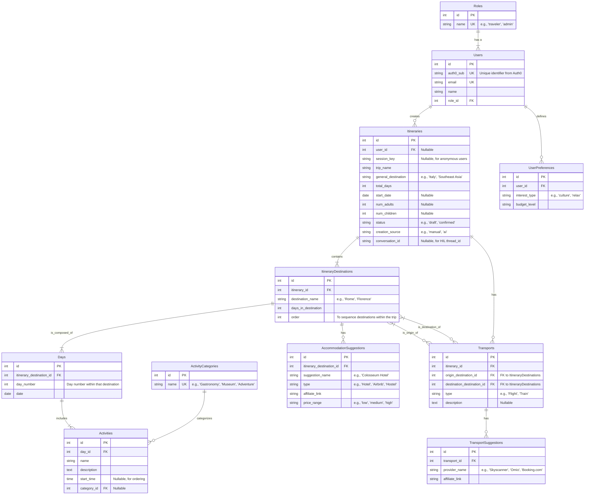

# TravelSmart 🌎✈️

TravelSmart es una plataforma innovadora diseñada para revolucionar la manera en que planificamos nuestros viajes. Combinando la potencia de la inteligencia artificial con la flexibilidad de la planificación manual, TravelSmart ofrece una experiencia única para crear itinerarios de viaje personalizados.


## 🎯 Sobre el Proyecto

TravelSmart nace de la necesidad de simplificar la planificación de viajes, ofreciendo dos enfoques principales:

### 🤖 Planificación con IA
Nuestro sistema de inteligencia artificial analiza tu destino y la duración de tu viaje para generar automáticamente itinerarios optimizados. La IA considera:
- Puntos de interés más relevantes
- Tiempos de traslado óptimos
- Secuencia lógica de actividades
- Recomendaciones personalizadas basadas en el destino y en las preferencias del usuario

### ✏️ Planificación Manual
Para aquellos que prefieren un control total sobre su itinerario, ofrecemos una interfaz intuitiva que permite:
- Crear planes día a día
- Personalizar actividades
- Organizar tiempos y secuencias
- Flexibilidad total en la planificación

## 🌟 Características Principales

- **Interfaz Intuitiva**: Diseño moderno y fácil de usar que hace la planificación de viajes una experiencia agradable
- **Flexibilidad**: Libertad para elegir entre planificación automática, manual o híbrida
- **Personalización**: Adaptación completa a las preferencias del viajero
- **Itinerarios Inteligentes**: Sugerencias basadas en datos reales y experiencias de viaje
- **Diseño Responsivo**: Experiencia perfecta en cualquier dispositivo

## 💡 Visión

TravelSmart busca transformar la manera en que las personas planifican sus viajes, combinando la eficiencia de la tecnología moderna con la personalización que cada viajero necesita. Nuestro objetivo es hacer que la planificación de viajes sea tan emocionante como el viaje mismo.

---

Desarrollado con ❤️ para viajeros por viajeros

## Estructura del Proyecto

```
travelsmart-frontend/
├── src/
│   ├── assets/       # Imágenes, fuentes y otros archivos estáticos
│   ├── components/   # Componentes reutilizables
│   ├── hooks/        # Custom hooks
│   ├── pages/        # Componentes de página
│   ├── services/     # Servicios para API y otras funcionalidades externas
│   ├── types/        # Definiciones de tipos TypeScript
│   ├── utils/        # Utilidades y helpers
│   ├── App.tsx       # Componente principal
│   ├── main.tsx      # Punto de entrada
│   └── index.css     # Estilos globales con Tailwind
├── public/           # Archivos accesibles públicamente
├── index.html        # Plantilla HTML
├── tailwind.config.js # Configuración de Tailwind CSS
├── postcss.config.js # Configuración de PostCSS
├── tsconfig.json     # Configuración de TypeScript
└── vite.config.ts    # Configuración de Vite
```

## Instalación

1. Clona el repositorio
```bash
git clone <url-del-repositorio>
cd travelsmart-frontend
```

2. Instala las dependencias
```bash
npm install
```

3. Inicia el servidor de desarrollo
```bash
npm run dev
```

## Scripts Disponibles

- `npm run dev` - Inicia el servidor de desarrollo
- `npm run build` - Compila el proyecto para producción
- `npm run lint` - Ejecuta el linter para verificar la calidad del código
- `npm run preview` - Vista previa de la build de producción localmente

## Buenas Prácticas Implementadas

- **Estructura de carpetas organizada** - Código organizado por funcionalidad
- **Componentes reutilizables** - Componentes como Button diseñados para ser utilizados en toda la aplicación
- **Custom hooks** - Hooks personalizados como useLocalStorage para lógica reutilizable
- **TypeScript** - Tipado estático para reducir errores y mejorar la documentación
- **Tailwind CSS** - Utilidades CSS para un diseño consistente y eficiente
- **Persistencia de datos** - Uso del localStorage para almacenar datos entre sesiones

## Tecnologías Utilizadas

- [React](https://react.dev/) - Biblioteca de UI
- [TypeScript](https://www.typescriptlang.org/) - Superset tipado de JavaScript
- [Vite](https://vitejs.dev/) - Herramienta de compilación rápida
- [Tailwind CSS](https://tailwindcss.com/) - Framework CSS utility-first

## Esquema base de datos


